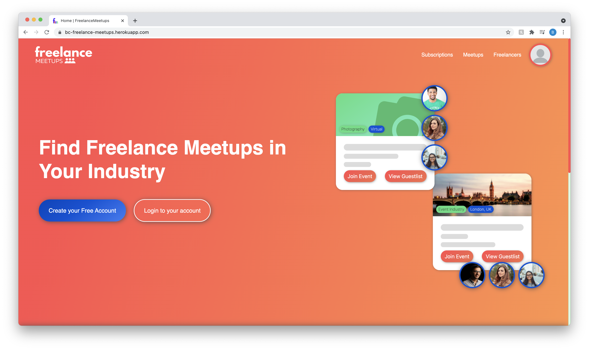
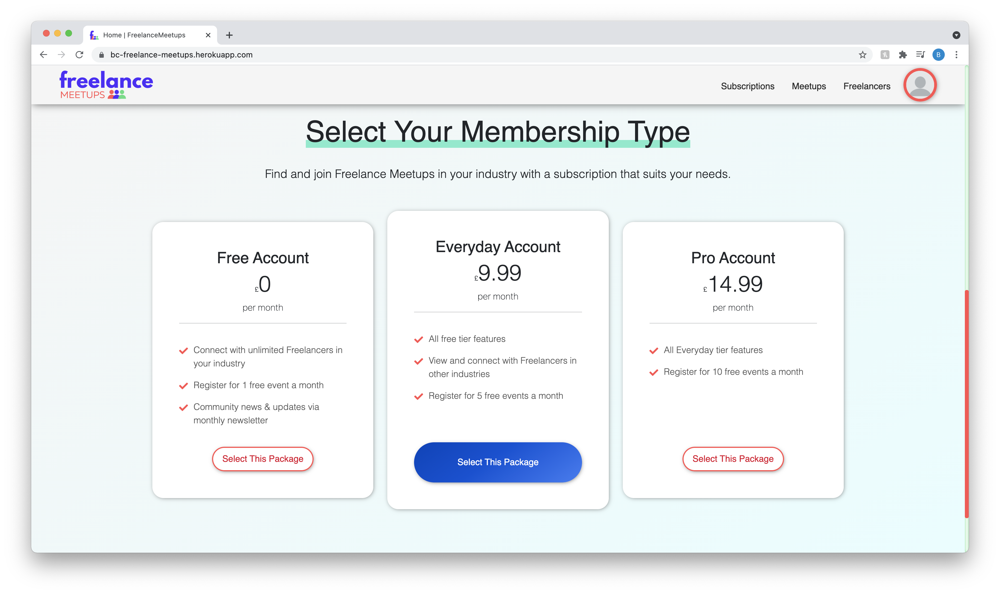
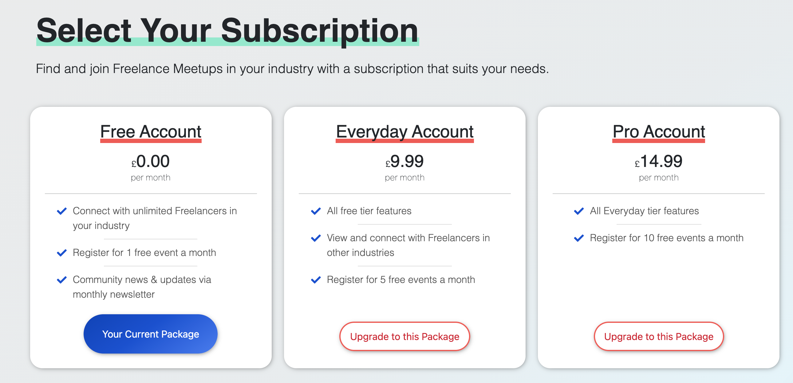
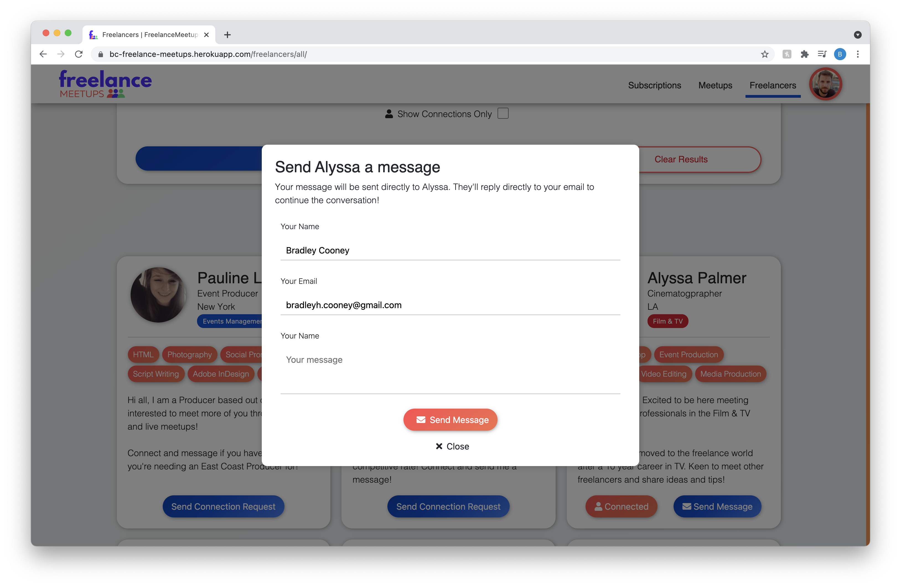
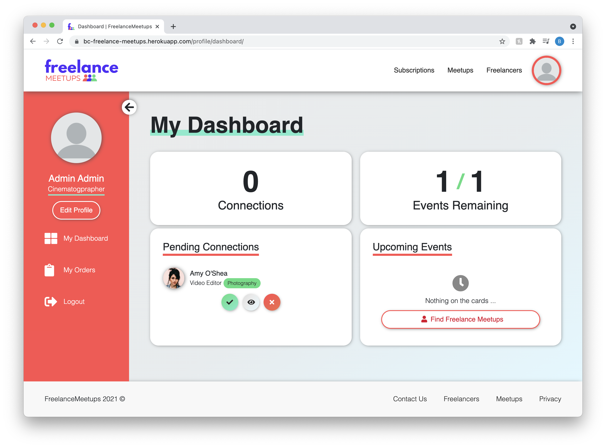
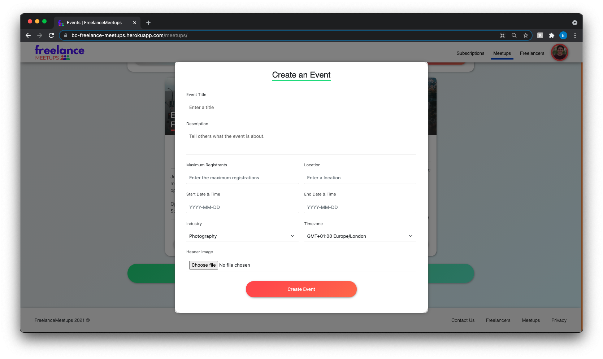

# FreelanceMeetups Testing Documentation

## Contents

- [User Stories Testing](#user-stories)
- [Technical Testing](#technical-testing)
    - [Code Validators](#code-validation)
    - [Responsive Testing](#responsive-testing)
    - [Compatability Testing](#compatibility-testing)
    - [Accessibility Testing](#Accessibility-testing)
    - [Lighthouse Testing](#Lighthouse-testing)
    - [Bugs & Known Issues](#bugs-&-known-issues)

- Technical Testing
    - Code Validators
    - Responsive Design 
    - Compatability (Browser & Device)
    - Bugs & Known Issues

### **User Stories**
The below section covers the user story testing that has taken place and evidence that the user objective has been achieved.

#### As a **first time user** I want to:
    
- <em>Be able to easily navigate the site and register before committing to a monthly subscription.</em>
- <em>Quickly identify the benefits of signing up for a paid membership.</em>
- <em>Evaluate the difference in subscriptions and best suited to my needs.</em>

Before authentication, the user can see what the site has to offer through the homepage, before requiring any payment. The homepage clearly outlines the purpose of the site, and the packages and features available:

 

#### As a returning **Freelancer** I want to:

- <em>Create a user profile so other users can find me and connect with me.</em>
- <em>Add my skills and role to my profile to highlight to other users what my expertise is and what I may have in common with them.</em>
- <em>Add my location to my profile so I can see events nearby to me vs events I would be unable to attend.</em>
- <em>Be able to hide my profile to remain anonymous to other users if I do not want to be contacted or connected with.</em>

When a user registers for a free account, they are automatically taken to the 'edit profile' page, enabling them to complete their profile information. Whilst users can navigate away from this page, they must complete this form in order for them to be visible to other users. They are notified of this by a message when the page loads.

- <em>Be able to subscribe to a monthly subscription and have access to membership only features like events and user connections.</em>
- <em>Be able to upgrade my subscription to have access to increased feature allowances such as more event attendance.</em>
- <em>Be able to downgrade my subscription to stop any further costs being charged to my credit card.</em>
- <em>Securely submit my card details when completing an order to be confident that my credit card details are stored safely in line with security best practice.</em>

When a registered user clicks navigates to 'Subscriptions', they are shown the packages available and the features within each of these. If they have an account, they are shown their current package, and the other packages are available to select.

 

If the user does not yet have a paid subscription, they are shown the card payment page, where users can securely enter their card details and confirm. This process generates a Stripe customer and subscription for the user on page load, then either attaches the package if payment is successful, otherwise destroys the Stripe customer and subscription if the page is abandoned.

 

Once the user has a paid package and Stripe subscription, any further attempts to purchase a package will inform the user that they will be upgraded and billed at the end of the month using their default payment method.

 

- <em>Be able to view my past transactions to see my previous usage and billing summary.</em>
- <em>Download invoices of my past payments	and have a copy of proof of purchase for my records.</em>

After successful purchase of the package, the user is directed to the 'My Orders' page, where they can see their previous orders, upcoming orders and downlowd any invoices. These orders are presented directly from Stripe, but attached to a server-side order, which links the order to the user for future admin reference.

- <em>Register and unregister for Meetups I am interested in.</em>
- <em>See who is attending events I am attending.</em>

Users can view the Meetups available on the 'Meetups' page accessible by the navbar and footer. This page allows users to register and unregister from events by clicking the call to action buttons on the bottom of each card. A user can see who is attending an event by clicking 'Attendees' on each card.

- <em>Connect with other users.</em>
- <em>Message other users once connected.</em>
- <em>Approve or decline connection requests sent to me.</em>

For users connecting with others, this can be done on the 'Freelancers' page. Once here, users can send a connection request to other users, accept incoming requests or if connected, send a message. To view their existing connections, users can user the filter on the Freelancers page to view these.

Users can also use the 'My Dashboard' page to accept, reject, or view more details of an incoming connection.

 

#### As a **Site Owner** I want to:

-<em> Manage users via an admin CMS.</em>
-<em> Access order details for customers.</em>
-<em> Add, edit and delete events via the site frontend.</em>

Using the Django Admin interface, admins are able to manage users - their core information, as well as toggle admin and profile visibility as required. Order details can also be accessed, but not edited.

For events, admins can add, edit and delete events directly from the Event Listings page. If the user has an `is_admin` field of `True`, then the UI will show a 'create' button at the bottom of the page, and 'edit event' on each event card. To delete an event, the user simply clicks 'delete event' on the edit modal.

-<em> Enable users to contact me if there are any issues with their account.</em>

Users can use the contact page on the footer to notify the site owner of any issues. This form will send a direct email, to which the owner can reply to.

-<em> Require users to verify their email before registration is confirmed.</em>
-<em> Only show user accounts if users have completed their profiles, so only content rich information is shown to other users.</em>

As described aboved, upon registration, users must verify their email address before they are able to login. Once logged in for the first time, they are directed to 'edit profile'. This form has validation which requires completion. Only if the form is submitted successfully will the profile visibility be switched on.

- Technical Testing
    - Code Validators
    - Responsive Design 
    - Compatability (Browser & Device)
    - Bugs & Known Issues
